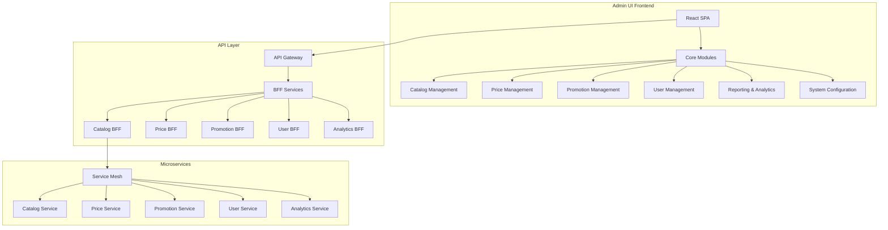

# Catalog Management Admin UI: Comprehensive Plan

## 1. Overview and Requirements

### Core Requirements
- **Unified Admin Interface**: A single platform for managing all aspects of the commerce ecosystem
- **PIM Capabilities**: Comprehensive product information management
- **Reporting & Dashboards**: Advanced analytics and visualization
- **Microservice Integration**: Seamless connection with catalog, price, promotions, user services, etc.
- **Robust & Secure**: Enterprise-grade security and reliability
- **Maintainable**: Clean architecture with separation of concerns

### User Roles & Permissions
- Catalog Managers
- Merchandisers
- Content Editors
- Administrators
- Role-based access control across all modules

## 2. Recommended Tech Stack

### Frontend
**Primary Framework: React with TypeScript**
- **Why React**:
  - Mature ecosystem with enterprise adoption
  - Component-based architecture for reusability
  - Strong community support and extensive libraries
  - Excellent performance with virtual DOM
  - TypeScript adds type safety and better maintainability

**UI Component Library: Material-UI (MUI)**
- Enterprise-grade components
- Customizable theming
- Accessibility built-in
- Responsive design support

**State Management**:
- Redux Toolkit for global state
- React Query for server state management and caching

**Additional Libraries**:
- Formik & Yup for form handling and validation
- React Router for navigation
- Recharts/D3.js for data visualization
- i18next for internationalization

### Backend
**API Gateway: Spring Cloud Gateway**
- Centralized routing to microservices
- Authentication/authorization
- Rate limiting and circuit breaking

**Authentication: OAuth 2.0 / OpenID Connect**
- JWT-based authentication
- Integration with existing identity providers

**Backend for Frontend (BFF) Pattern**:
- Spring Boot services to aggregate data from microservices
- GraphQL API for efficient data fetching

### DevOps & Infrastructure
- Docker for containerization
- Kubernetes for orchestration
- CI/CD pipeline with Jenkins or GitHub Actions
- Monitoring with Prometheus and Grafana

## 3. Architecture Design



## 4. Core Modules & Features

### 1. Catalog Management Module
- **Product Management**
  - CRUD operations for products
  - Bulk import/export
  - Product variants management
  - Rich media management
  - Product validation workflows

- **Category Management**
  - Hierarchical category structure
  - Category-specific attributes
  - Category templates

- **Attribute Management**
  - Dynamic attribute creation
  - Validation rules
  - Multi-value support
  - Attribute groups

- **Channel & Platform Management**
  - Channel-specific product visibility
  - Platform-specific configurations

### 2. Price Management Module
- Base price management
- Price rules and conditions
- Channel-specific pricing
- Bulk price updates
- Price history and versioning

### 3. Promotion Management Module
- Promotion creation and scheduling
- Eligibility rules
- Discount types and calculations
- Promotion analytics

### 4. User & Merchant Management Module
- User administration
- Role-based access control
- Merchant onboarding
- Seller management

### 5. Reporting & Analytics Module
- **Dashboards**
  - Catalog health metrics
  - Data quality scores
  - Workflow status
  - Completion rates

- **Reports**
  - Product completeness
  - Category distribution
  - Attribute usage
  - Custom report builder

### 6. System Configuration Module
- Feature flags
- Workflow configuration
- Validation rules
- Integration settings

## 5. UI Design Principles

### 1. Information Architecture
- Hierarchical navigation
- Context-aware breadcrumbs
- Consistent layout patterns
- Progressive disclosure of complex features

### 2. User Experience
- Responsive design for all devices
- Keyboard shortcuts for power users
- Bulk operations for efficiency
- Inline editing capabilities
- Advanced search and filtering

### 3. Accessibility
- WCAG 2.1 AA compliance
- Screen reader compatibility
- Keyboard navigation
- Color contrast requirements

## 6. Integration Strategy

### 1. API Integration
- RESTful API consumption
- GraphQL for complex data requirements
- Webhook support for real-time updates

### 2. Authentication & Authorization
- Single sign-on (SSO)
- Role-based access control
- Fine-grained permissions

### 3. Data Synchronization
- Real-time updates where needed
- Scheduled synchronization for bulk operations
- Conflict resolution strategies

## 7. Implementation Approach

### Phase 1: Foundation
- Core architecture setup
- Authentication and authorization
- Basic product and category management
- UI component library and design system

### Phase 2: Core PIM Features
- Complete product management
- Advanced category management
- Attribute system
- Basic reporting

### Phase 3: Extended Features
- Integration with price service
- Integration with promotion service
- Advanced reporting and dashboards
- Workflow management

### Phase 4: Advanced Capabilities
- AI-assisted categorization
- Advanced search capabilities
- Bulk operations optimization
- Performance enhancements

## 8. Maintenance & Support

### 1. Monitoring
- Frontend performance monitoring
- API response times
- Error tracking and reporting

### 2. Updates
- Regular dependency updates
- Security patches
- Feature enhancements

### 3. Documentation
- User guides
- API documentation
- Architecture documentation
- Onboarding materials

## 9. Alternatives Considered

### Alternative Frontend Frameworks
1. **Angular**
   - Pros: Comprehensive framework, TypeScript native, enterprise support
   - Cons: Steeper learning curve, heavier bundle size, less flexibility

2. **Vue.js**
   - Pros: Gentle learning curve, good performance, growing ecosystem
   - Cons: Smaller enterprise adoption, fewer specialized libraries

### Alternative UI Libraries
1. **Ant Design**
   - Pros: Feature-rich components, enterprise focus
   - Cons: Less customizable, stronger visual opinions

2. **Custom Design System**
   - Pros: Complete control, brand alignment
   - Cons: Development overhead, maintenance burden

### Alternative Backend Approaches
1. **Node.js BFF**
   - Pros: JavaScript throughout stack, potentially faster development
   - Cons: Less type safety, different ecosystem from existing services

2. **Direct Microservice Access**
   - Pros: Simpler architecture, fewer components
   - Cons: Security concerns, tighter coupling, potential performance issues

## 10. Conclusion and Recommendations

Based on the analysis of your requirements and codebase, we recommend:

1. **React with TypeScript + Material-UI** for the frontend
2. **Spring Cloud Gateway + BFF pattern** for the backend integration
3. **Modular architecture** that can grow with your microservices ecosystem
4. **Phased implementation approach** starting with core PIM capabilities

This combination provides:
- Enterprise-grade reliability and security
- Excellent developer experience and maintainability
- Scalability to handle complex catalog requirements
- Flexibility to integrate with all your microservices
- Comprehensive PIM, reporting, and dashboard capabilities

## 11. Implementation Code Structure

### Frontend Project Structure

```
catalog-admin-ui/
├── public/
│   ├── index.html
│   ├── favicon.ico
│   └── assets/
├── src/
│   ├── assets/
│   │   ├── images/
│   │   └── styles/
│   ├── components/
│   │   ├── common/
│   │   │   ├── Button/
│   │   │   ├── Card/
│   │   │   ├── Table/
│   │   │   └── ...
│   │   ├── layout/
│   │   │   ├── Header/
│   │   │   ├── Sidebar/
│   │   │   ├── Footer/
│   │   │   └── ...
│   │   └── modules/
│   │       ├── catalog/
│   │       ├── price/
│   │       ├── promotion/
│   │       └── ...
│   ├── config/
│   │   ├── routes.ts
│   │   ├── api.ts
│   │   └── theme.ts
│   ├── hooks/
│   │   ├── useAuth.ts
│   │   ├── useFetch.ts
│   │   └── ...
│   ├── pages/
│   │   ├── catalog/
│   │   │   ├── ProductList.tsx
│   │   │   ├── ProductDetail.tsx
│   │   │   ├── CategoryList.tsx
│   │   │   └── ...
│   │   ├── price/
│   │   ├── promotion/
│   │   └── ...
│   ├── services/
│   │   ├── api.ts
│   │   ├── auth.ts
│   │   └── ...
│   ├── store/
│   │   ├── slices/
│   │   │   ├── authSlice.ts
│   │   │   ├── catalogSlice.ts
│   │   │   └── ...
│   │   └── store.ts
│   ├── types/
│   │   ├── product.ts
│   │   ├── category.ts
│   │   └── ...
│   ├── utils/
│   │   ├── formatters.ts
│   │   ├── validators.ts
│   │   └── ...
│   ├── App.tsx
│   └── index.tsx
├── .eslintrc.js
├── .prettierrc
├── package.json
├── tsconfig.json
└── README.md
```

### Backend BFF Structure

```
catalog-admin-bff/
├── src/
│   ├── main/
│   │   ├── java/
│   │   │   └── com/
│   │   │       └── tata/
│   │   │           └── commerce/
│   │   │               ├── config/
│   │   │               │   ├── SecurityConfig.java
│   │   │               │   ├── GatewayConfig.java
│   │   │               │   └── ...
│   │   │               ├── controller/
│   │   │               │   ├── CatalogController.java
│   │   │               │   ├── PriceController.java
│   │   │               │   └── ...
│   │   │               ├── dto/
│   │   │               │   ├── ProductDTO.java
│   │   │               │   ├── CategoryDTO.java
│   │   │               │   └── ...
│   │   │               ├── service/
│   │   │               │   ├── CatalogService.java
│   │   │               │   ├── PriceService.java
│   │   │               │   └── ...
│   │   │               ├── client/
│   │   │               │   ├── CatalogServiceClient.java
│   │   │               │   ├── PriceServiceClient.java
│   │   │               │   └── ...
│   │   │               ├── exception/
│   │   │               │   ├── GlobalExceptionHandler.java
│   │   │               │   ├── ServiceException.java
│   │   │               │   └── ...
│   │   │               └── CatalogAdminBffApplication.java
│   │   └── resources/
│   │       ├── application.yml
│   │       ├── application-dev.yml
│   │       └── application-prod.yml
│   └── test/
│       └── java/
│           └── com/
│               └── tata/
│                   └── commerce/
│                       ├── controller/
│                       ├── service/
│                       └── ...
├── pom.xml
└── README.md
```

## 12. Key Implementation Details

### Frontend Implementation

#### Authentication Flow

```typescript
// src/services/auth.ts
import { createApi, fetchBaseQuery } from '@reduxjs/toolkit/query/react';

export const authApi = createApi({
  reducerPath: 'authApi',
  baseQuery: fetchBaseQuery({ baseUrl: '/api/auth/' }),
  endpoints: (builder) => ({
    login: builder.mutation({
      query: (credentials) => ({
        url: 'login',
        method: 'POST',
        body: credentials,
      }),
    }),
    logout: builder.mutation({
      query: () => ({
        url: 'logout',
        method: 'POST',
      }),
    }),
    getCurrentUser: builder.query({
      query: () => 'me',
    }),
  }),
});

export const { useLoginMutation, useLogoutMutation, useGetCurrentUserQuery } = authApi;
```

#### Product Management Component

```typescript
// src/pages/catalog/ProductList.tsx
import React, { useState } from 'react';
import { 
  DataGrid, 
  GridColDef, 
  GridToolbar 
} from '@mui/x-data-grid';
import { 
  Button, 
  Box, 
  Typography, 
  Chip 
} from '@mui/material';
import { useGetProductsQuery } from '../../services/api';

const ProductList: React.FC = () => {
  const { data: products, isLoading, error } = useGetProductsQuery();
  const [selectedProducts, setSelectedProducts] = useState<string[]>([]);

  const columns: GridColDef[] = [
    { field: 'id', headerName: 'ID', width: 90 },
    { field: 'code', headerName: 'Code', width: 150 },
    { field: 'name', headerName: 'Name', width: 200 },
    { field: 'status', headerName: 'Status', width: 120,
      renderCell: (params) => (
        <Chip 
          label={params.value} 
          color={params.value === 'ACTIVE' ? 'success' : 'default'} 
          size="small" 
        />
      ),
    },
    { field: 'category', headerName: 'Category', width: 150 },
    { field: 'price', headerName: 'Price', width: 120, type: 'number' },
    { field: 'createdAt', headerName: 'Created At', width: 180, type: 'dateTime' },
    { field: 'updatedAt', headerName: 'Updated At', width: 180, type: 'dateTime' },
  ];

  if (isLoading) return <div>Loading products...</div>;
  if (error) return <div>Error loading products</div>;

  return (
    <Box sx={{ height: 600, width: '100%' }}>
      <Box sx={{ display: 'flex', justifyContent: 'space-between', mb: 2 }}>
        <Typography variant="h5">Products</Typography>
        <Box>
          <Button 
            variant="contained" 
            color="primary" 
            sx={{ mr: 1 }}
            disabled={selectedProducts.length === 0}
          >
            Edit Selected
          </Button>
          <Button 
            variant="contained" 
            color="secondary"
          >
            Add New Product
          </Button>
        </Box>
      </Box>
      <DataGrid
        rows={products || []}
        columns={columns}
        pageSize={10}
        rowsPerPageOptions={[10, 25, 50]}
        checkboxSelection
        disableSelectionOnClick
        components={{ Toolbar: GridToolbar }}
        onSelectionModelChange={(newSelection) => {
          setSelectedProducts(newSelection as string[]);
        }}
        loading={isLoading}
      />
    </Box>
  );
};

export default ProductList;
```

### Backend Implementation

#### API Gateway Configuration

```java
// src/main/java/com/tata/commerce/config/GatewayConfig.java
package com.tata.commerce.config;

import org.springframework.cloud.gateway.route.RouteLocator;
import org.springframework.cloud.gateway.route.builder.RouteLocatorBuilder;
import org.springframework.context.annotation.Bean;
import org.springframework.context.annotation.Configuration;

@Configuration
public class GatewayConfig {

    @Bean
    public RouteLocator customRouteLocator(RouteLocatorBuilder builder) {
        return builder.routes()
                .route("catalog_service", r -> r
                        .path("/api/catalog/**")
                        .filters(f -> f
                                .rewritePath("/api/catalog/(?<segment>.*)", "/${segment}")
                                .addRequestHeader("X-Source", "admin-ui"))
                        .uri("lb://catalog-service"))
                .route("price_service", r -> r
                        .path("/api/price/**")
                        .filters(f -> f
                                .rewritePath("/api/price/(?<segment>.*)", "/${segment}")
                                .addRequestHeader("X-Source", "admin-ui"))
                        .uri("lb://price-service"))
                .route("promotion_service", r -> r
                        .path("/api/promotion/**")
                        .filters(f -> f
                                .rewritePath("/api/promotion/(?<segment>.*)", "/${segment}")
                                .addRequestHeader("X-Source", "admin-ui"))
                        .uri("lb://promotion-service"))
                .route("user_service", r -> r
                        .path("/api/user/**")
                        .filters(f -> f
                                .rewritePath("/api/user/(?<segment>.*)", "/${segment}")
                                .addRequestHeader("X-Source", "admin-ui"))
                        .uri("lb://user-service"))
                .build();
    }
}
```

#### Catalog BFF Service

```java
// src/main/java/com/tata/commerce/service/CatalogService.java
package com.tata.commerce.service;

import com.tata.commerce.client.CatalogServiceClient;
import com.tata.commerce.dto.ProductDTO;
import com.tata.commerce.dto.CategoryDTO;
import com.tata.commerce.exception.ServiceException;
import org.springframework.beans.factory.annotation.Autowired;
import org.springframework.stereotype.Service;
import reactor.core.publisher.Flux;
import reactor.core.publisher.Mono;

import java.util.List;
import java.util.UUID;

@Service
public class CatalogService {

    private final CatalogServiceClient catalogServiceClient;

    @Autowired
    public CatalogService(CatalogServiceClient catalogServiceClient) {
        this.catalogServiceClient = catalogServiceClient;
    }

    public Flux<ProductDTO> getAllProducts() {
        return catalogServiceClient.getAllProducts()
                .onErrorResume(e -> {
                    throw new ServiceException("Failed to fetch products", e);
                });
    }

    public Mono<ProductDTO> getProductById(UUID id) {
        return catalogServiceClient.getProductById(id)
                .onErrorResume(e -> {
                    throw new ServiceException("Failed to fetch product with id: " + id, e);
                });
    }

    public Mono<ProductDTO> createProduct(ProductDTO productDTO) {
        return catalogServiceClient.createProduct(productDTO)
                .onErrorResume(e -> {
                    throw new ServiceException("Failed to create product", e);
                });
    }

    public Mono<ProductDTO> updateProduct(UUID id, ProductDTO productDTO) {
        return catalogServiceClient.updateProduct(id, productDTO)
                .onErrorResume(e -> {
                    throw new ServiceException("Failed to update product with id: " + id, e);
                });
    }

    public Mono<Void> deleteProduct(UUID id) {
        return catalogServiceClient.deleteProduct(id)
                .onErrorResume(e -> {
                    throw new ServiceException("Failed to delete product with id: " + id, e);
                });
    }

    public Flux<CategoryDTO> getAllCategories() {
        return catalogServiceClient.getAllCategories()
                .onErrorResume(e -> {
                    throw new ServiceException("Failed to fetch categories", e);
                });
    }

    // Additional methods for category management, attribute management, etc.
}
```

## 13. Deployment Strategy

### Docker Compose Setup

```yaml
# docker-compose.yml
version: '3.8'

services:
  catalog-admin-ui:
    build:
      context: ./catalog-admin-ui
      dockerfile: Dockerfile
    ports:
      - "80:80"
    depends_on:
      - catalog-admin-bff
    environment:
      - API_URL=http://catalog-admin-bff:8080
    networks:
      - commerce-network

  catalog-admin-bff:
    build:
      context: ./catalog-admin-bff
      dockerfile: Dockerfile
    ports:
      - "8080:8080"
    depends_on:
      - catalog-service
      - price-service
      - promotion-service
      - user-service
    environment:
      - SPRING_PROFILES_ACTIVE=prod
      - CATALOG_SERVICE_URL=http://catalog-service:8081
      - PRICE_SERVICE_URL=http://price-service:8082
      - PROMOTION_SERVICE_URL=http://promotion-service:8083
      - USER_SERVICE_URL=http://user-service:8084
    networks:
      - commerce-network

  catalog-service:
    image: tata-commerce/catalog-service:latest
    ports:
      - "8081:8081"
    environment:
      - SPRING_PROFILES_ACTIVE=prod
      - DB_URL=jdbc:postgresql://postgres:5432/catalog_db
      - DB_USERNAME=postgres
      - DB_PASSWORD=postgres
    networks:
      - commerce-network

  price-service:
    image: tata-commerce/price-service:latest
    ports:
      - "8082:8082"
    environment:
      - SPRING_PROFILES_ACTIVE=prod
      - DB_URL=jdbc:postgresql://postgres:5432/price_db
      - DB_USERNAME=postgres
      - DB_PASSWORD=postgres
    networks:
      - commerce-network

  promotion-service:
    image: tata-commerce/promotion-service:latest
    ports:
      - "8083:8083"
    environment:
      - SPRING_PROFILES_ACTIVE=prod
      - DB_URL=jdbc:postgresql://postgres:5432/promotion_db
      - DB_USERNAME=postgres
      - DB_PASSWORD=postgres
    networks:
      - commerce-network

  user-service:
    image: tata-commerce/user-service:latest
    ports:
      - "8084:8084"
    environment:
      - SPRING_PROFILES_ACTIVE=prod
      - DB_URL=jdbc:postgresql://postgres:5432/user_db
      - DB_USERNAME=postgres
      - DB_PASSWORD=postgres
    networks:
      - commerce-network

  postgres:
    image: postgres:14
    ports:
      - "5432:5432"
    environment:
      - POSTGRES_PASSWORD=postgres
      - POSTGRES_USER=postgres
      - POSTGRES_MULTIPLE_DATABASES=catalog_db,price_db,promotion_db,user_db
    volumes:
      - postgres-data:/var/lib/postgresql/data
    networks:
      - commerce-network

networks:
  commerce-network:
    driver: bridge

volumes:
  postgres-data:
```

### Kubernetes Deployment

```yaml
# kubernetes/catalog-admin-ui-deployment.yaml
apiVersion: apps/v1
kind: Deployment
metadata:
  name: catalog-admin-ui
  namespace: commerce
spec:
  replicas: 2
  selector:
    matchLabels:
      app: catalog-admin-ui
  template:
    metadata:
      labels:
        app: catalog-admin-ui
    spec:
      containers:
      - name: catalog-admin-ui
        image: tata-commerce/catalog-admin-ui:latest
        ports:
        - containerPort: 80
        env:
        - name: API_URL
          value: http://catalog-admin-bff-service:8080
        resources:
          limits:
            cpu: "500m"
            memory: "512Mi"
          requests:
            cpu: "200m"
            memory: "256Mi"
        livenessProbe:
          httpGet:
            path: /health
            port: 80
          initialDelaySeconds: 30
          periodSeconds: 10
        readinessProbe:
          httpGet:
            path: /health
            port: 80
          initialDelaySeconds: 5
          periodSeconds: 5
---
apiVersion: v1
kind: Service
metadata:
  name: catalog-admin-ui-service
  namespace: commerce
spec:
  selector:
    app: catalog-admin-ui
  ports:
  - port: 80
    targetPort: 80
  type: ClusterIP
---
apiVersion: networking.k8s.io/v1
kind: Ingress
metadata:
  name: catalog-admin-ui-ingress
  namespace: commerce
  annotations:
    kubernetes.io/ingress.class: nginx
    nginx.ingress.kubernetes.io/ssl-redirect: "true"
spec:
  rules:
  - host: admin.tatacommerce.com
    http:
      paths:
      - path: /
        pathType: Prefix
        backend:
          service:
            name: catalog-admin-ui-service
            port:
              number: 80
  tls:
  - hosts:
    - admin.tatacommerce.com
    secretName: tatacommerce-tls
```

## 14. Next Steps

1. **Setup Development Environment**
   - Initialize React project with TypeScript
   - Configure Spring Boot BFF service
   - Set up development tools and linting

2. **Create UI Component Library**
   - Implement design system
   - Build reusable components
   - Create theme and styling

3. **Implement Core Authentication**
   - Set up OAuth 2.0 integration
   - Implement login/logout flow
   - Configure role-based access control

4. **Develop Catalog Management Module**
   - Build product management screens
   - Implement category management
   - Create attribute management system

5. **Integrate with Backend Services**
   - Connect to catalog service
   - Implement BFF aggregation layer
   - Set up error handling and resilience

6. **Implement Reporting & Dashboard**
   - Create analytics dashboard
   - Build custom report builder
   - Implement data visualization

7. **Extend to Additional Modules**
   - Price management
   - Promotion management
   - User management

8. **Setup CI/CD Pipeline**
   - Configure automated testing
   - Implement deployment automation
   - Set up monitoring and alerting